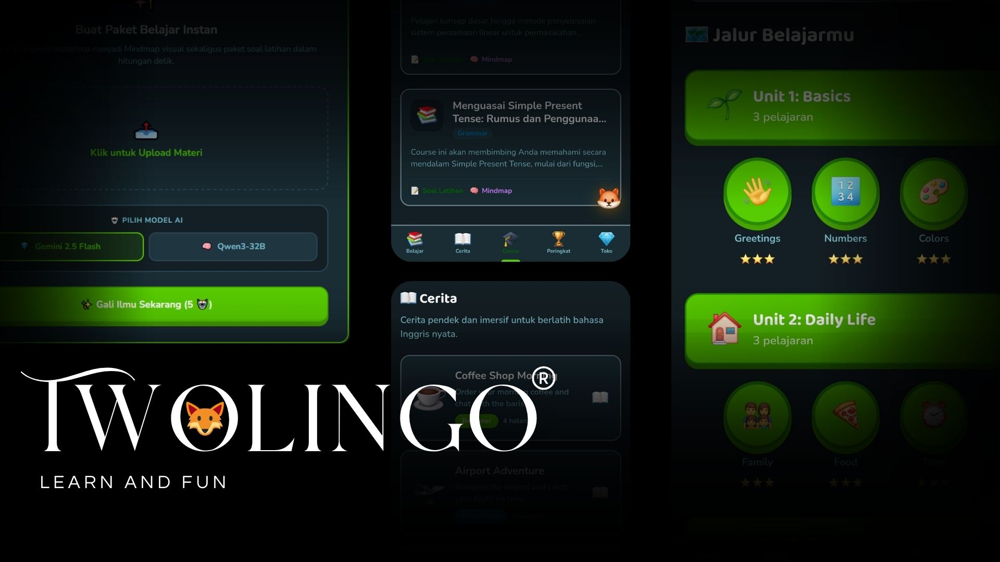

# 🦊 Twolingo

**Learn English every day with the fun way.**

---

Twolingo is a free English learning app that makes studying feel like a game.
Earn XP, keep your streak alive, compete on the leaderboard, and level up your English. One lesson at a time.

---

## What you can do

- 📚 **Take lessons** — multiple choice, translation, fill in the blank, and word arrangement
- 🔥 **Build streaks** — come back daily and watch your streak grow
- ⚡ **Earn XP & Gems** — get rewarded for every lesson you complete
- 🏆 **Climb the leaderboard** — see how you rank against other learners
- 📖 **Read stories** — short English stories to sharpen your reading
- 🛍️ **Visit the shop** — spend your gems on power ups and streak protection

---

## How to get started

1. Go to [twolingo.vercel.app](https://twolingo.vercel.app)
2. Create a free account
3. Start your first lesson, it only takes a minute!

---

Made with ❤️ by **Satria**

⭐ Star this repo if you like it!

